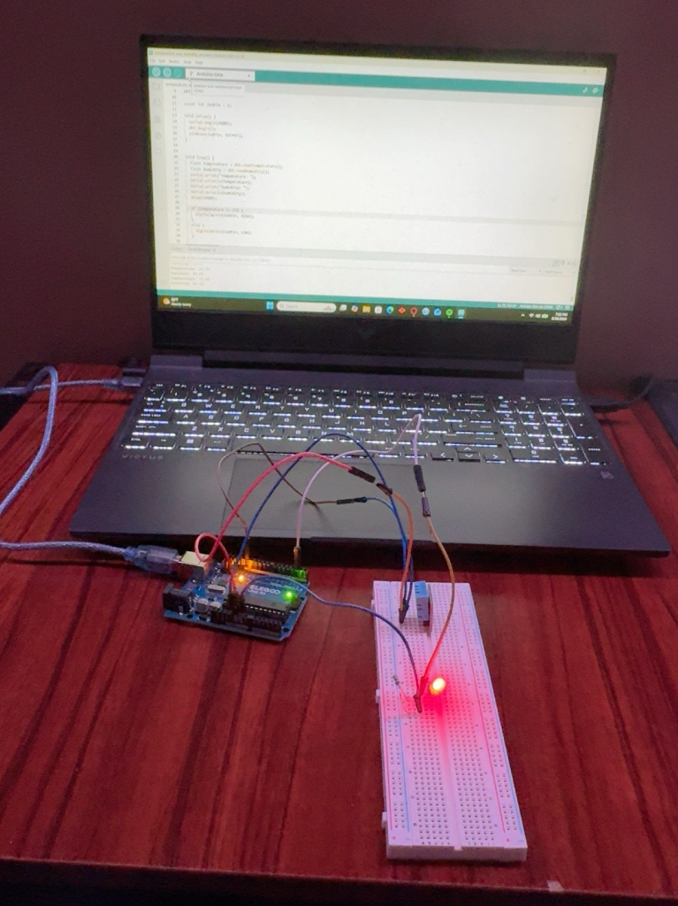

# Temperature and Humidity Monitor
An Arduino project that reads temperature and humidity using a DHT11 sensor and turns on an LED when the temp reaches a set threshold.

## Project Demo

## Components Used
-Arduino UNO
-DHT11 Temperature and Humidity Sensor
-LED
-Current-limiting resistor
-Breadboard
-Jumper wires

## How it works
The DHT11 sensor measures the temperature and humidity of the surrounding environment. The Arduino reads these values every 2 seconds and displays them in the Serial Monitor.
If the temperature reaches 23 C or higher, the arduino sends a HIGH signal to the LED, turning it on. When the temperature drops below 23C, the LED turns off.

## Features
-Real-time temperature monitoring
-Real-time humidity monitoring
-Automatic temperature warning LED
-sensor error detection
-Serial monitor output
-Updates every 2 seconds
