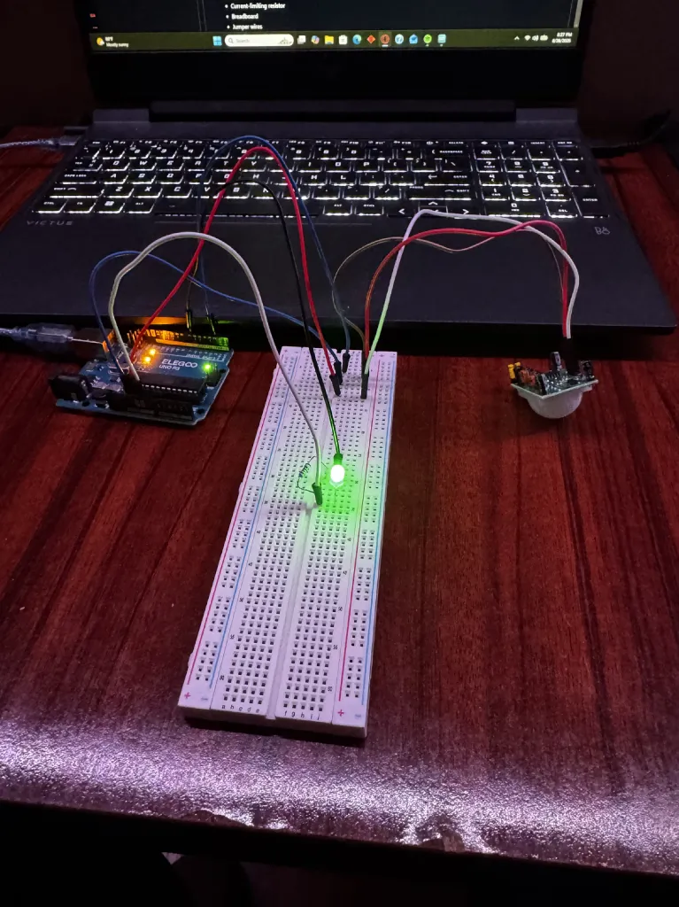

# Motion-Activated Light

An Arduino project that uses a PIR motion sensor to detect movement and automatically control an LED.

## Project Demo

## Components Used

- Arduino Uno
- HC-SR501 PIR Motion Sensor
- LED
- Current-limiting resistor
- Breadboard
- Jumper wires

## Wiring

### PIR Motion Sensor
- VCC → Arduino 5V
- GND → Arduino GND
- OUT → Arduino Digital Pin 2

### LED
- Arduino Digital Pin 7 → LED long leg (anode/+)
- LED short leg (cathode/-) → resistor
- Other side of resistor → Arduino GND

## How It Works

The PIR sensor detects changes in infrared radiation caused by movement in front of the sensor.

The Arduino reads the PIR sensor's digital output and stores the result in `motionState`.

- `motionState = HIGH` → Motion detected → LED ON
- `motionState = LOW` → No motion detected → LED OFF

The Arduino continuously checks the sensor inside `loop()`, allowing the LED to automatically respond to movement.

## Features

- Real-time motion detection
- Automatic LED control
- Digital sensor input
- Serial Monitor output for debugging
- Automatic response to changes in sensor state

## What I Learned

- How to interface a PIR motion sensor with an Arduino
- How to use `digitalRead()` to read a digital sensor
- The difference between an input and an output
- How to store sensor states in variables
- How to use `if/else` logic to control hardware
- The difference between `=` and `==`
- How to test a sensor independently before integrating an output
- How PIR sensor calibration affects readings
