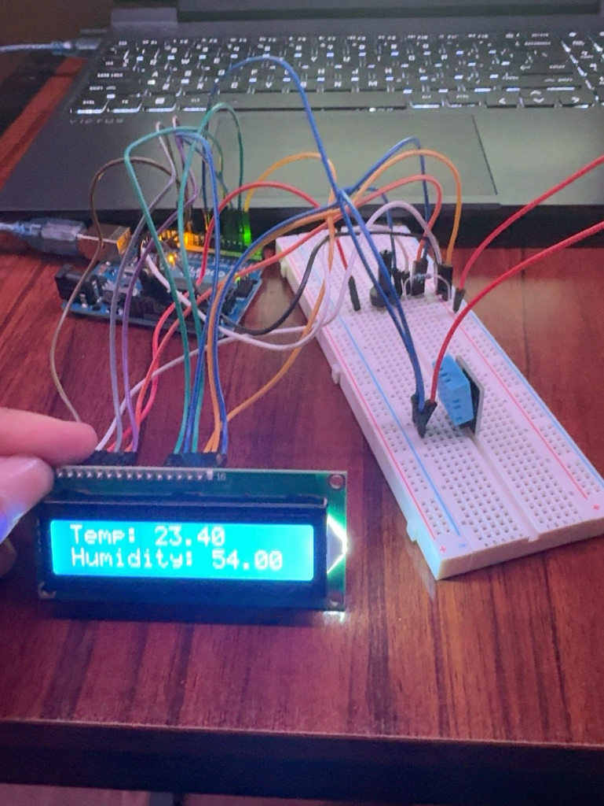

# LCD Temperature and Humidity Monitor
An Arduino-based environmental monitoring system that reads live temperature and humidity data from a DHT11 sensor and displays the readings on a 16x2 LCD screen.

## Project Demo

## Components
Arduino Uno
DHT11 Temperature and Humidity Sensor
16x2 LCD Display
Potentiometer
Breadboard
Jumper Wires

## How It Works
The DHT11 sensor measures the surrounding temperature and humidity.

The Arduino reads both sensor values and sends the information to the 16x2 LCD.

The first row displays the current temperature, while the second row displays the current humidity.

## Wiring
### DHT11
VCC → 5V
GND → GND
Signal → Digital Pin 8

### LCD
The LCD is operated in 4-bit mode using the Arduino LiquidCrystal library.

RS → Pin 12
Enable → Pin 11
D4 → Pin 5
D5 → Pin 4
D6 → Pin 3
D7 → Pin 2

A potentiometer is connected to the LCD contrast pin to allow the display contrast to be adjusted.

## What I Learned
Through this project, I learned how to:

Interface multiple hardware components with one Arduino
Read temperature and humidity data from a DHT11 sensor
Control a 16x2 LCD using the LiquidCrystal library
Display variables and live sensor readings on an LCD
Use lcd.setCursor() to control text positioning
Distribute 5V and GND to multiple components using breadboard power rails
Combine concepts from previous Arduino projects into a larger system

## Future Improvements
Possible improvements include adding motion detection, automatic fan or lighting control, warning indicators, and additional environmental sensors.

These concepts will eventually be combined into a larger Smart Room Controller project.

