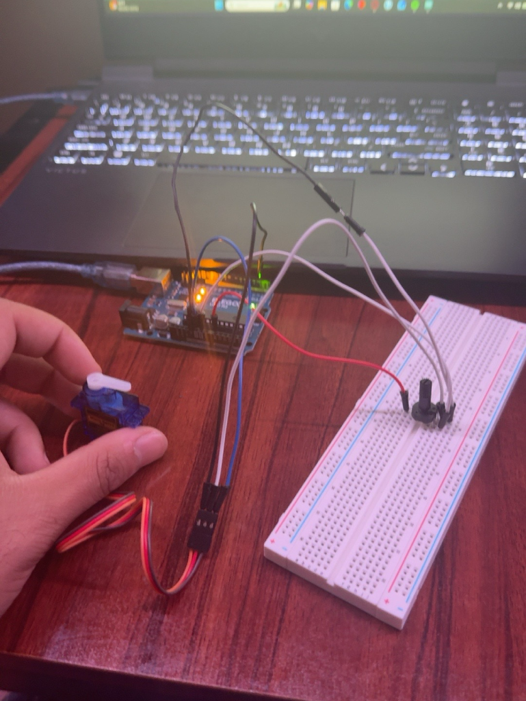

Potentiometer-Controlled Servo Motor
An Arduino project that uses a potentiometer to control the position of a servo motor in real time. The Arduino reads the analog input from the potentiometer, converts the reading into an angle, and commands the servo to move to that position.

Project Demo

Components
Arduino Uno
Servo Motor
Potentiometer
Breadboard
Jumper Wires
USB Cable

How It Works
The potentiometer produces an analog value between approximately 0 and 1023 depending on the position of the knob.

The Arduino reads this value using analogRead().

The map() function converts the potentiometer's 0–1023 input range into the servo's 0–180 degree position range.

The converted angle is then sent to the servo using myServo.write().

The Serial Monitor also displays both the raw potentiometer reading and the calculated servo angle for debugging and monitoring.

Wiring
Servo Motor
Brown/Black → GND
Red → 5V
Orange/Yellow Signal → Digital Pin 2

Potentiometer
Outer Leg → 5V
Middle Leg → A0
Other Outer Leg → GND
``
## What I Learned

Through this project, I learned how to:

- Control a servo motor with an Arduino
- Read analog input using analogRead()
- Work with potentiometer values from 0–1023
- Use map() to convert one numerical range into another
- Control servo position using Servo.write()`
Use the Arduino Servo library
Display live values using Serial Monitor
Convert a physical user input into a mechanical output

## System Flow
Potentiometer movement → Analog input → Arduino → Value mapping → Servo angle → Physical movement

## Future Improvements
Possible improvements include:

Displaying the servo angle on an LCD
Controlling the servo using a sensor instead of a potentiometer
Adding buttons for preset servo positions
Using the servo as part of an automated vent, door, or other mechanical system
Integrating the servo into a larger Smart Room Controller

## Skills Demonstrated
Arduino programming
C/C++ fundamentals
Analog sensor input
Servo motor control
Hardware interfacing
Input/output mapping
Serial debugging
