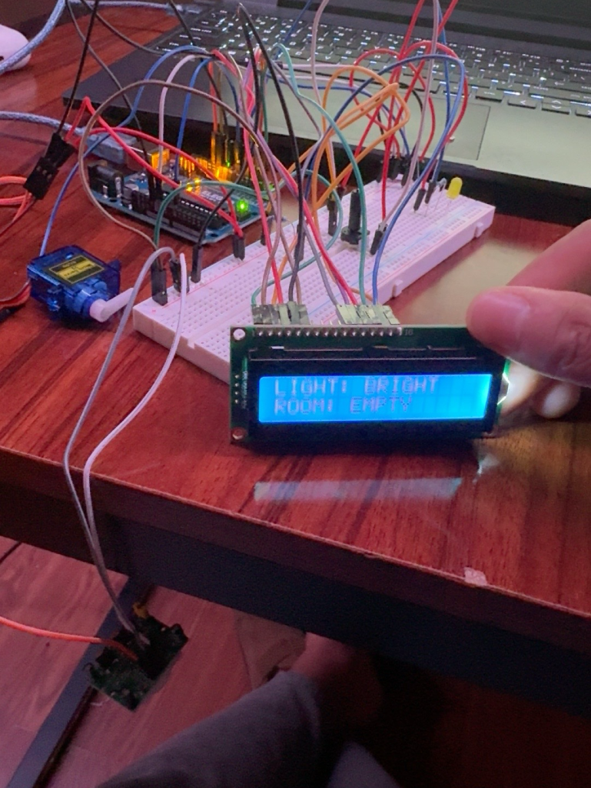

# Arduino Smart Room Controller

A multi-sensor Arduino automation system that monitors room brightness and motion, then automatically controls lighting and a servo motor while displaying the room's current status on a 16x2 LCD.

This project combines several individual Arduino concepts into one integrated embedded system.

## Project Demo



## Features

- Detects room brightness using a photoresistor
- Detects movement using a PIR motion sensor
- Automatically turns on an LED when the room is dark and motion is detected
- Automatically controls a servo based on room occupancy
- Displays live room conditions on a 16x2 LCD
- Outputs sensor readings to Serial Monitor for debugging
- Combines analog inputs, digital inputs, decision logic, and multiple outputs

## Components

- Arduino Uno
- Breadboard
- Photoresistor
- 10kΩ resistor
- PIR motion sensor
- LED
- 220Ω resistor
- SG90 servo motor
- 16x2 LCD
- Potentiometer
- Jumper wires
- USB cable

## Pin Configuration

| Component | Arduino Pin |
|---|---|
| Photoresistor | A0 |
| PIR Sensor | D7 |
| LED | D6 |
| Servo | D9 |
| LCD RS | D12 |
| LCD Enable | D11 |
| LCD D4 | D5 |
| LCD D5 | D4 |
| LCD D6 | D3 |
| LCD D7 | D2 |

## System Logic

The Smart Room Controller continuously monitors two inputs:

### Light Sensor

The photoresistor measures the ambient light level.

A threshold value determines whether the room is considered:

- `BRIGHT`
- `DARK`

### Motion Sensor

The PIR sensor determines whether movement is currently detected.

The room is classified as:

- `MOTION`
- `EMPTY`

### Automatic Lighting

The LED turns on only when BOTH conditions are true:

```cpp
lightValue < lightThreshold && motionState == HIGH
```

This means:

| Room Condition | LED |
|---|---|
| Bright + Empty | OFF |
| Bright + Motion | OFF |
| Dark + Empty | OFF |
| Dark + Motion | ON |

### Servo Automation

The servo acts as a simulated automated room mechanism such as a vent or door.

Motion detected:

```text
Servo → 90°
```

No motion:

```text
Servo → 0°
```

## LCD Interface

The LCD provides real-time system information.

Example:

```text
LIGHT: BRIGHT
ROOM: EMPTY
```

When the room becomes dark:

```text
LIGHT: DARK
ROOM: EMPTY
```

When movement is detected:

```text
LIGHT: DARK
ROOM: MOTION
```

## How It Works

The system follows this general control flow:

```text
        Photoresistor
             ↓
        Light Level ──────┐
                          │
                          ↓
PIR Sensor → Motion → Arduino Uno
                          │
              ┌───────────┼───────────┐
              ↓           ↓           ↓
             LED        Servo        LCD
              ↓           ↓           ↓
          Lighting    Mechanical    Status
          Control      Control      Display
```

The Arduino continuously reads the sensors, processes their values, makes decisions using conditional statements, and updates the outputs.

## Key Programming Concepts

This project uses:

- `analogRead()`
- `digitalRead()`
- `digitalWrite()`
- `if / else`
- Logical AND (`&&`)
- Variables
- Threshold values
- Servo control
- LCD control
- Serial communication
- Multiple input/output devices

## Development Process

Instead of building the entire system at once, each subsystem was built and tested individually.

The development process was:

```text
Photoresistor
      ↓
Test
      ↓
Add LED
      ↓
Test
      ↓
Add PIR
      ↓
Test
      ↓
Combine Light + Motion Logic
      ↓
Test
      ↓
Add Servo
      ↓
Test
      ↓
Add LCD
      ↓
Final Integration Test
```

This approach made it easier to identify wiring, programming, and integration problems without debugging the entire circuit simultaneously.

## Testing

Four main operating states were tested:

1. Bright room + no motion
2. Bright room + motion
3. Dark room + no motion
4. Dark room + motion

The LED, servo, LCD, PIR sensor, and photoresistor responded correctly in all four operating states.

## What I Learned

Through this project, I learned how to:

- Integrate multiple Arduino subsystems
- Read analog and digital sensors simultaneously
- Create automated control logic
- Combine multiple conditions using logical operators
- Control multiple outputs from sensor information
- Interface with servo motors
- Interface with a 16x2 LCD
- Debug hardware using Serial Monitor
- Troubleshoot wiring and programming errors
- Test embedded systems incrementally
- Build a complete sensor-to-processing-to-output system

## Future Improvements

Future versions could include:

- Temperature and humidity monitoring
- Wi-Fi connectivity using an ESP32
- Smartphone control
- Remote sensor monitoring
- Automatic fan control
- Adjustable light thresholds
- Manual/automatic operating modes
- Data logging
- IoT dashboard
- PCB version of the circuit
- Custom enclosure

## Skills Demonstrated

- Arduino
- Embedded C/C++
- Sensor integration
- Analog electronics
- Digital I/O
- Embedded systems debugging
- Servo motor control
- LCD interfacing
- Automation logic
- Hardware/software integration
- Breadboard prototyping

## Project Status

**Completed and fully functional.**
